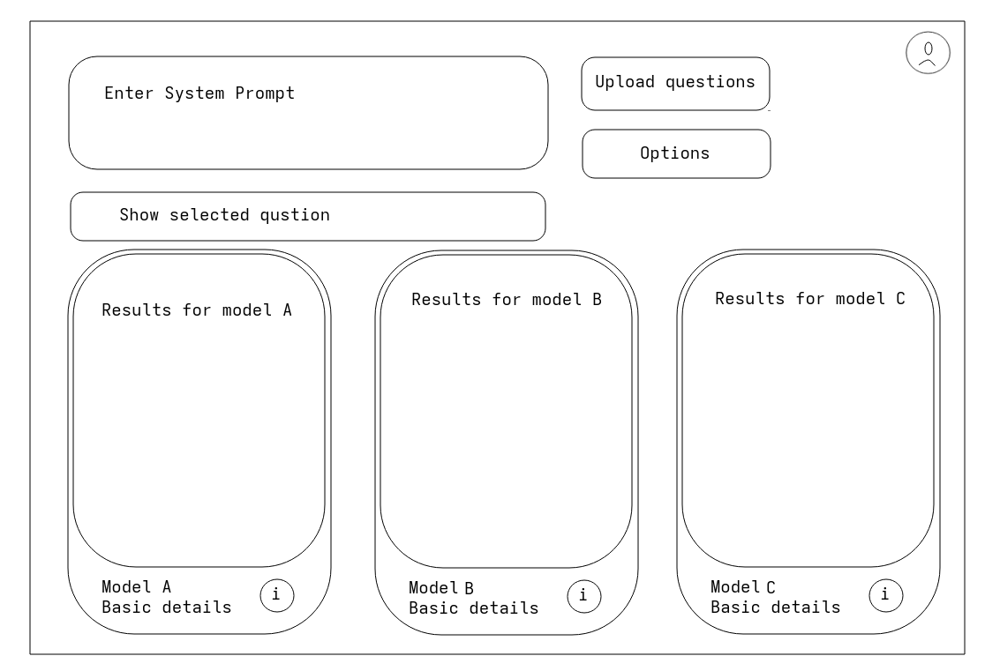

I want to make a promp optimization website for my company to work internally.
The website should have the following features:
1. Login for internal employees only.
2. A dashboard to upload the test questions as json or txt file. This file will have all the questions in it.
3. There should be a text window to enter a system prompt. 
4. There should be an options button that will let the user select a question from the uploaded file.
5. The selected question should be shown in a text field. 
6. The user should be able to select 3 models to run tests on.
7. There should be a send button that will set the system prompt and send the question to the models.
8. The models should return the response and the response should be shown in a text field corresponding to the model.
9. The user should be able to select a model to run tests on individually to retry/regenerate.
10. There should be relevant data about the model response such as tokens used, time taken, etc. shown below the model name.
11. On pressing the i button next to the model name, it should open a card with the model's response and extensive data about the response like tokens used, time taken, and more.
12. There should be a button to download the response of all models or a single model.
13. All the models will be run in parallel.
14. The API to use will be openrouter. You can find its documentation here: https://openrouter.ai/docs/quickstart 
15. The website should be responsive.

This is the template for the UI.

You can decide on the colours, modify the layout, add or remove features, but the core functionality should all be there.
I want you to make the website user friendly and easy to navigate.
On the backend you can use python and any other language you want. Use best coding practices and make the code easy to read and maintain.
Make sure it is scalable. Make a .env file to store the API keys and other sensitive information and .env.example file to store the example values so if I upload it to github it doesn't get leaked. Make sure you start a git local repository, maintain a documentation folder and a README.md file. Create a .gitignore file to ignore the .env file and other sensitive files/system files. Use virtual environment to manage dependencies. Use best practices for code quality and maintainability. Use best practices for security. Use best practices for performance. 